# Big Data: Batch Processing with MapReduce


## Hadoop cluster

Using `Docker` we can easily get `hadoop cluster` running in our local machine by containerizing:
- `namenode`: the master node in cluster.
- `datanode`: the slave node who for storing files blocs.
- `nodemanager`: is responsible for managing the execution of individual tasks on each node
- `resource-manager`: handles global resource management and job scheduling.

all those nodes, use the same docker image `apache/hadoop:3.3.6`.


#### Docker-compose file

```yaml
version: "3.8"
services:
   namenode:
      image: apache/hadoop:3.3.6
      hostname: namenode
      command: ["hdfs", "namenode"]
      ports:
        - 9870:9870
      env_file:
        - ./config
      environment:
        ENSURE_NAMENODE_DIR: "/tmp/hadoop-root/dfs/name"
      volumes:
        - ./jars:/opt/hadoop/jars
        - ./shared:/opt/hadoop/shared
   datanode:
      image: apache/hadoop:3.3.6
      command: ["hdfs", "datanode"]
      env_file:
        - ./config      
   resourcemanager:
      image: apache/hadoop:3.3.6
      hostname: resourcemanager
      command: ["yarn", "resourcemanager"]
      ports:
         - 8088:8088
      env_file:
        - ./config
      volumes:
        - ./test.sh:/opt/test.sh
   nodemanager:
      image: apache/hadoop:3.3.6
      command: ["yarn", "nodemanager"]
      env_file:
        - ./config


```

#### Config file

```properties
HADOOP_HOME=/opt/hadoop
CORE-SITE.XML_fs.default.name=hdfs://namenode
CORE-SITE.XML_fs.defaultFS=hdfs://namenode
HDFS-SITE.XML_dfs.namenode.rpc-address=namenode:8020
HDFS-SITE.XML_dfs.replication=2
MAPRED-SITE.XML_mapreduce.framework.name=yarn
MAPRED-SITE.XML_yarn.app.mapreduce.am.env=HADOOP_MAPRED_HOME=$HADOOP_HOME
MAPRED-SITE.XML_mapreduce.map.env=HADOOP_MAPRED_HOME=$HADOOP_HOME
MAPRED-SITE.XML_mapreduce.reduce.env=HADOOP_MAPRED_HOME=$HADOOP_HOME
YARN-SITE.XML_yarn.resourcemanager.hostname=resourcemanager
YARN-SITE.XML_yarn.nodemanager.pmem-check-enabled=false
YARN-SITE.XML_yarn.nodemanager.delete.debug-delay-sec=600
YARN-SITE.XML_yarn.nodemanager.vmem-check-enabled=false
YARN-SITE.XML_yarn.nodemanager.aux-services=mapreduce_shuffle
CAPACITY-SCHEDULER.XML_yarn.scheduler.capacity.maximum-applications=10000
CAPACITY-SCHEDULER.XML_yarn.scheduler.capacity.maximum-am-resource-percent=0.1
CAPACITY-SCHEDULER.XML_yarn.scheduler.capacity.resource-calculator=org.apache.hadoop.yarn.util.resource.DefaultResourceCalculator
CAPACITY-SCHEDULER.XML_yarn.scheduler.capacity.root.queues=default
CAPACITY-SCHEDULER.XML_yarn.scheduler.capacity.root.default.capacity=100
CAPACITY-SCHEDULER.XML_yarn.scheduler.capacity.root.default.user-limit-factor=1
CAPACITY-SCHEDULER.XML_yarn.scheduler.capacity.root.default.maximum-capacity=100
CAPACITY-SCHEDULER.XML_yarn.scheduler.capacity.root.default.state=RUNNING
CAPACITY-SCHEDULER.XML_yarn.scheduler.capacity.root.default.acl_submit_applications=*
CAPACITY-SCHEDULER.XML_yarn.scheduler.capacity.root.default.acl_administer_queue=*
CAPACITY-SCHEDULER.XML_yarn.scheduler.capacity.node-locality-delay=40
CAPACITY-SCHEDULER.XML_yarn.scheduler.capacity.queue-mappings=
CAPACITY-SCHEDULER.XML_yarn.scheduler.capacity.queue-mappings-override.enable=false

```

#### Starting hadoop cluster

to start the cluster described in `docker-compose.yml` file, we can use the following command:

```shell
docker-compose up --scale datanode=3 -d
```


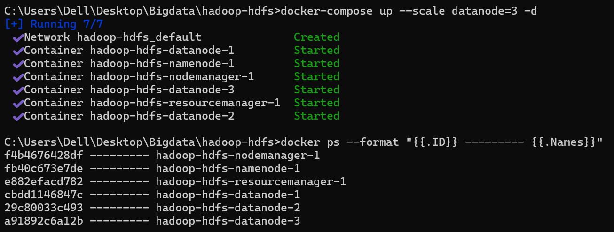


we can access to `bash` of `namenode` using:

```shell
docker exec -it <NAME-NODE-CONTAINER-ID> bash
```

## MapReduce Jobs

in the following examples, we are going to show how mapreduce try to process files stored 
in `Hadoop cluster`:
- the first example is about analyse a `sales.txt` file, then create an `output file` containing sum of sales by cities
- in the second example we try to go away with first example and get `sales by cities in a given year`.
- the last example showing `server logs analyses` example, we try to find out the total request made and number of successes request by `IP address`

So to create all those `MapReduce Jobs` we use `Java 8` and some `hadoop and MapReduce dependencies`:

```xml
 <dependencies>

        <!-- https://mvnrepository.com/artifact/org.apache.hadoop/hadoop-common -->
        <dependency>
            <groupId>org.apache.hadoop</groupId>
            <artifactId>hadoop-common</artifactId>
            <version>${hadoop.version}</version>
            <scope>provided</scope>
        </dependency>


        <!-- https://mvnrepository.com/artifact/org.apache.hadoop/hadoop-mapreduce-client-core -->
        <dependency>
            <groupId>org.apache.hadoop</groupId>
            <artifactId>hadoop-mapreduce-client-core</artifactId>
            <version>${hadoop.version}</version>
            <scope>provided</scope>
        </dependency>
        
    </dependencies>
```
we notice that `scope` set to `provided` because the `namenode` in `hadoop cluster`
contains all necessary jars file, including `MapReduce` jars.

### Example 1: Total of sales by cities

the structure of the processed `sales.txt` file is the: `date city product price`:

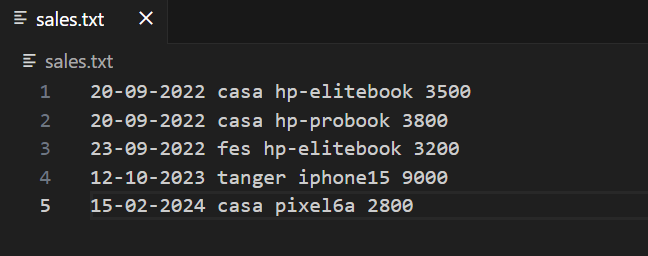

the file is stored in a `volume` where we have a shared directory called `shared`, and we are going to put 
it later into hdfs.

in this example we create `SaleByCityMapper` and `SaleByCityReducer` and also `SaleByCityJob`.

#### SaleByCityMapper

```java
package md.hajji.sales;

import org.apache.hadoop.io.DoubleWritable;
import org.apache.hadoop.io.LongWritable;
import org.apache.hadoop.io.Text;
import org.apache.hadoop.mapreduce.Mapper;
import java.io.IOException;

/**
 * type parameters:
 * LongWritable: is the type of the Key of input, which will be the Index of first char in line.
 * Text: is the type of the value, in this case we get a line
 * Text: The type of the output key, which will be city name.
 * DoubleWritable: the type of the output value, which will be the price of soling product
 */

public class SaleByCityMapper extends Mapper<LongWritable, Text, Text, DoubleWritable> {
    
    @Override
    protected void map(LongWritable key, Text value, Mapper<LongWritable, Text, Text, DoubleWritable>.Context context) throws IOException, InterruptedException {
        // split line into tokens:
        String[] tokens = value.toString().split(" ");
        // getting the city and product price value
        String city = tokens[1];
        double price = Double.parseDouble(tokens[3]);
        // pass the resolved details to the next Reducer
        context.write(new Text(city), new DoubleWritable(price));

    }
}

```

#### SaleByCityReducer

```java
package md.hajji.sales;

import org.apache.hadoop.io.DoubleWritable;
import org.apache.hadoop.io.Text;
import org.apache.hadoop.mapreduce.Reducer;

import java.io.IOException;
import java.util.stream.StreamSupport;


/**
 * type parameters for reducer:
 * Text: The type of the input key, which will be city name.
 * Iterable<DoubleWritable>: the type of the input value, which will be list of prices of soling products
 * Text: The type of the output key, which will be city name.
 * DoubleWritable: the type of the output value, which will be sum of all prices of soling products
 */

public class SaleByCityReducer extends Reducer<Text, DoubleWritable, Text, DoubleWritable> {
    @Override
    protected void reduce(Text key, Iterable<DoubleWritable> values, Reducer<Text, DoubleWritable, Text, DoubleWritable>.Context context) throws IOException, InterruptedException {

        // calculate the sum  of prices:
        double sum = StreamSupport.stream(values.spliterator(), false)
                .mapToDouble(DoubleWritable::get)
                .sum();

        // write the result in the output:
        context.write(key, new DoubleWritable(sum));
    }
}

```

#### SaleByCityJob

```java
package md.hajji.sales;

import org.apache.hadoop.conf.Configuration;
import org.apache.hadoop.fs.Path;
import org.apache.hadoop.io.DoubleWritable;
import org.apache.hadoop.io.Text;
import org.apache.hadoop.mapreduce.Job;
import org.apache.hadoop.mapreduce.lib.input.FileInputFormat;
import org.apache.hadoop.mapreduce.lib.input.TextInputFormat;
import org.apache.hadoop.mapreduce.lib.output.FileOutputFormat;
import org.apache.log4j.Logger;

import java.io.IOException;

public class SaleByCityJob {

    private static final Logger logger = Logger.getLogger(SaleByCityJob.class);

    public static void main(String[] args) throws IOException, InterruptedException, ClassNotFoundException {

        logger.info("Starting SaleByCityJob");
        logger.info("input file: " + args[0]);

        // create MapReduce Job and setting name and jar class:
        Job saleByCityJob = Job.getInstance(new Configuration(), "SaleByCityJob");
        saleByCityJob.setJarByClass(SaleByCityJob.class);

        // set the input type which will be a text file:
        saleByCityJob.setInputFormatClass(TextInputFormat.class);

        // setting the appropriate mapper and reducer:
        saleByCityJob.setMapperClass(SaleByCityMapper.class);
        saleByCityJob.setReducerClass(SaleByCityReducer.class);

        // describe the output key and value types for mapping stage:
        saleByCityJob.setMapOutputKeyClass(Text.class);
        saleByCityJob.setMapOutputValueClass(DoubleWritable.class);

        // describe the output key and value types for reduce stage:
        saleByCityJob.setOutputKeyClass(Text.class);
        saleByCityJob.setOutputValueClass(DoubleWritable.class);

        // setting the input and output files:
        FileInputFormat.addInputPath(saleByCityJob, new Path(args[0]));
        FileOutputFormat.setOutputPath(saleByCityJob, new Path(args[1]));

        // wait job to finish:
        saleByCityJob.waitForCompletion(false);
        logger.info("SaleByCityJob completed");
        logger.info("Output file: " + args[1]);
    }
}

```

#### Generating the jar file for project

in order to generate the `jar` file, we use `maven` building tool, exactly `mvn clean package` command:

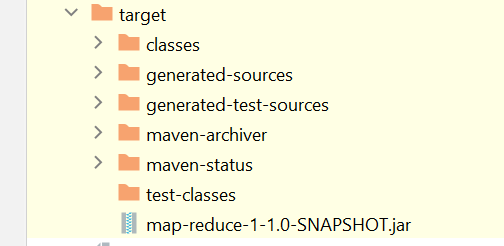

#### Put sales.txt file in HDFS

in order to our job consume the `sales.txt` file, 
we should put it in `HDFS`, so the file can be located by MapReduce jobs:

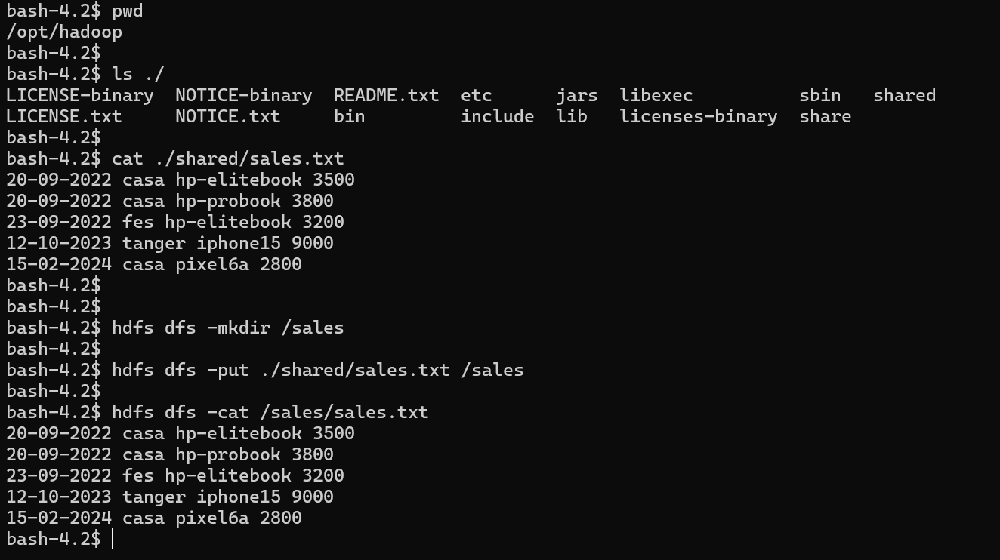

#### Run SaleByCityJob in Hadoop cluster 

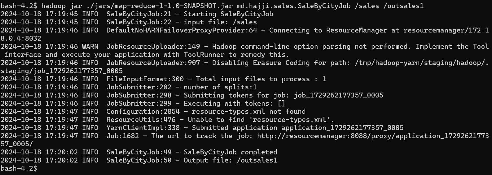

and we get the following results:

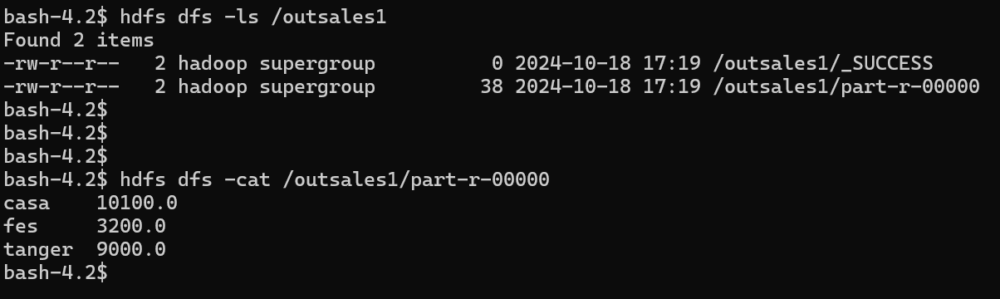


### Example 2: Total of sales by cities for a given year

In the same way, we create the `SaleByCityOfYearMapper` and `SaleByCityAndYearJob`, we are not going to 
create a `Redcuer class` for this job, because the previous job is enough

#### SaleByCityOfYearMapper

```java
package md.hajji.sales;

import org.apache.hadoop.io.DoubleWritable;
import org.apache.hadoop.io.LongWritable;
import org.apache.hadoop.io.Text;
import org.apache.hadoop.mapreduce.Mapper;
import java.io.IOException;
import java.time.LocalDate;
import java.time.format.DateTimeFormatter;

public class SaleByCityOfYearMapper extends Mapper<LongWritable, Text, Text, DoubleWritable> {

    private int year;

    @Override
    protected void setup(Mapper<LongWritable, Text, Text, DoubleWritable>.Context context) throws IOException, InterruptedException {
        // get year value from configuration context:
        year = context.getConfiguration().getInt("year", 2022);
    }

    @Override
    protected void map(LongWritable key, Text value, Mapper<LongWritable, Text, Text, DoubleWritable>.Context context) throws IOException, InterruptedException {
        // split line into tokens:
        String[] tokens = value.toString().split(" ");
        //parse the soling date:
        DateTimeFormatter formatter = DateTimeFormatter.ofPattern("dd-MM-yyyy");
        LocalDate date = LocalDate.parse(tokens[0], formatter);

        if (date.getYear() != year)
            return;

        // parse price:
        double price = Double.parseDouble(tokens[3]);
        // forward city and price to the reducer:
        context.write(new Text(tokens[1]), new DoubleWritable(price));
    }
}

```


#### SaleByCityAndYearJob

```java
package md.hajji.sales;

import org.apache.hadoop.conf.Configuration;
import org.apache.hadoop.fs.Path;
import org.apache.hadoop.io.DoubleWritable;
import org.apache.hadoop.io.Text;
import org.apache.hadoop.mapreduce.Job;
import org.apache.hadoop.mapreduce.lib.input.FileInputFormat;
import org.apache.hadoop.mapreduce.lib.input.TextInputFormat;
import org.apache.hadoop.mapreduce.lib.output.FileOutputFormat;
import org.apache.log4j.Logger;

import java.io.IOException;

public class SaleByCityAndYearJob {

    private static final Logger logger = Logger.getLogger(SaleByCityJob.class);


    public static void main(String[] args) throws IOException, InterruptedException, ClassNotFoundException {

        logger.info("Starting SaleByCityAndYearJob");
        logger.info("input file: " + args[0]);
        logger.info("searching sales for year: " + args[2]);

        Configuration configuration = new Configuration();

        // put the year argument in configuration, so
        // the mapper can access to year argument:
        configuration.set("year", args[2]);

        // create MapReduce Job and setting name and jar class:
        Job saleByCityAndYearJob = Job.getInstance(configuration, "SaleByCityAndYearJob");
        saleByCityAndYearJob.setJarByClass(SaleByCityAndYearJob.class);

        // set the input type which will be a text file:
        saleByCityAndYearJob.setInputFormatClass(TextInputFormat.class);

        // setting the appropriate mapper and reducer:
        saleByCityAndYearJob.setMapperClass(SaleByCityOfYearMapper.class);
        saleByCityAndYearJob.setReducerClass(SaleByCityReducer.class);

        // describe the output key and value types for mapping stage:
        saleByCityAndYearJob.setMapOutputKeyClass(Text.class);
        saleByCityAndYearJob.setMapOutputValueClass(DoubleWritable.class);

        // describe the output key and value types for reduce stage:
        saleByCityAndYearJob.setOutputKeyClass(Text.class);
        saleByCityAndYearJob.setOutputValueClass(DoubleWritable.class);

        // setting the input and output files:
        FileInputFormat.addInputPath(saleByCityAndYearJob, new Path(args[0]));
        FileOutputFormat.setOutputPath(saleByCityAndYearJob, new Path(args[1]));

        // wait job to finish:
        saleByCityAndYearJob.waitForCompletion(false);
        logger.info("SaleByCityAndYearJob completed");
        logger.info("Output file: " + args[1]);
    }
}

```
#### Run SaleByCityAndYearJob in Hadoop cluster 

in order to run `SaleByCityAndYearJob` we need to regenerate the jar file

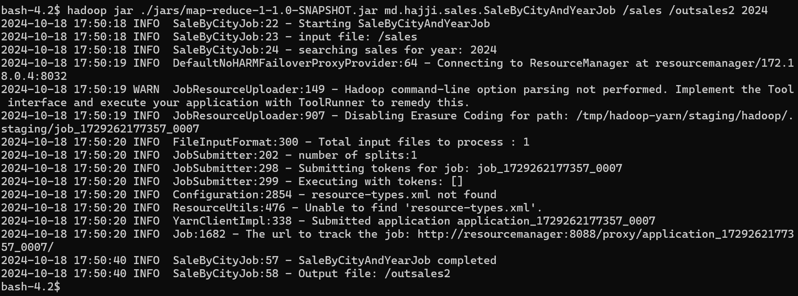

after job finishing:

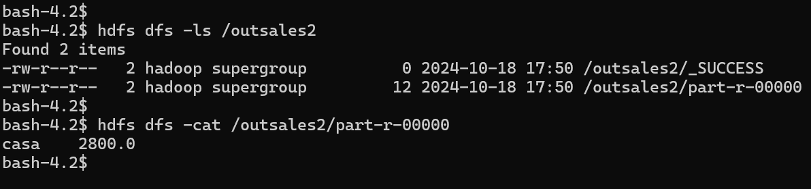


### Example 3: Logs analyser

the `logs.txt` file looks like:

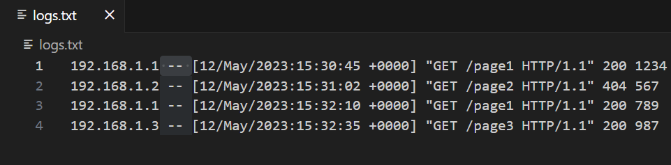

we stored using HDFS, but moving it from the `shared` directory to HDFS:

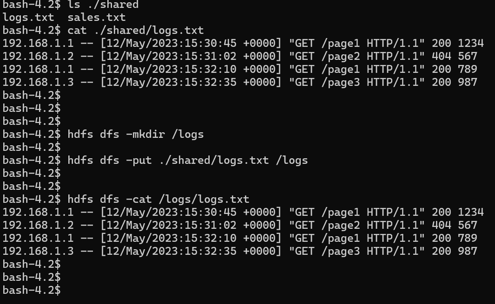

in this example we create three classes:
- `LogsMapper`: used in the mapping stage
- `LogsReducer`: used in the reducing stage
- `LogsAnalyserJob`: configure and run the mapreduce job


#### LogsMapper

```java

package md.hajji.logs;

import org.apache.hadoop.io.LongWritable;
import org.apache.hadoop.io.Text;
import org.apache.hadoop.mapreduce.Mapper;

import java.io.IOException;

public class LogsMapper extends Mapper<LongWritable, Text, Text, LongWritable> {

    private String ipAddress;

    @Override
    protected void setup(Mapper<LongWritable, Text, Text, LongWritable>.Context context) throws IOException, InterruptedException {
        // get the IP address from the context:
        ipAddress = context.getConfiguration().get("ipAddress");
    }

    @Override
    protected void map(LongWritable key, Text value, Mapper<LongWritable, Text, Text, LongWritable>.Context context) throws IOException, InterruptedException {

        // compute the request in order to add it to total request number:
        context.write(new Text("total-request"), new LongWritable(1));

        // split request line to tokens and parse the IP address:
        String[] tokens = value.toString().split(" -- ");
        String ipAddress = tokens[0];

        // ignore if no match between the request IP address and current
        // IP address:
        if (!this.ipAddress.equals(ipAddress))
            return;

        // parse the status code:
        int statusCode = Integer.parseInt(tokens[1].split(" ")[6]);

        // if the request was failed:
        if (statusCode != 200)
            return;

        // if not, add the request to IP address list:
        context.write(new Text(ipAddress), new LongWritable(1));
    }
}

```


#### LogsReducer

```java
package md.hajji.logs;

import org.apache.hadoop.io.LongWritable;
import org.apache.hadoop.io.Text;
import org.apache.hadoop.mapreduce.Reducer;

import java.io.IOException;
import java.util.stream.StreamSupport;

public class LogsReducer extends Reducer<Text, LongWritable, Text, LongWritable> {

    public void reduce(Text key, Iterable<LongWritable> values, Context context) throws IOException, InterruptedException {

        // compute the sum of total request
        // or succeeded requests:
        long sum = StreamSupport.stream(values.spliterator(), false)
                .mapToLong(LongWritable::get)
                .sum();

        // write the result in the output file
        context.write(key, new LongWritable(sum));
    }
}

```


#### LogsAnalyserJob

```java
package md.hajji.logs;

import md.hajji.sales.SaleByCityJob;
import org.apache.hadoop.conf.Configuration;
import org.apache.hadoop.fs.Path;
import org.apache.hadoop.io.LongWritable;
import org.apache.hadoop.io.Text;
import org.apache.hadoop.mapreduce.Job;
import org.apache.hadoop.mapreduce.lib.input.FileInputFormat;
import org.apache.hadoop.mapreduce.lib.input.TextInputFormat;
import org.apache.hadoop.mapreduce.lib.output.FileOutputFormat;
import org.apache.log4j.Logger;

import java.io.IOException;

public class LogsAnalyserJob {

    private static final Logger logger = Logger.getLogger(SaleByCityJob.class);

    public static void main(String[] args) throws IOException, InterruptedException, ClassNotFoundException {

        logger.info("Starting LogsAnalyserJob");
        logger.info("input file: " + args[0]);
        logger.info("searching logs for IP address: " + args[2]);

        // put the IP address argument in configuration, so
        // the mapper can access to it:
        Configuration configuration = new Configuration();
        configuration.set("ipAddress", args[2]);

        // create MapReduce Job and setting name and jar class:
        Job logsJob = Job.getInstance(configuration, "Logs analyser Job");
        logsJob.setJarByClass(LogsAnalyserJob.class);

        // set the input type which will be a text file:
        logsJob.setInputFormatClass(TextInputFormat.class);

        // setting the appropriate mapper and reducer:
        logsJob.setMapperClass(LogsMapper.class);
        logsJob.setReducerClass(LogsReducer.class);


        // describe the output key and value types for mapping stage:
        logsJob.setMapOutputKeyClass(Text.class);
        logsJob.setMapOutputValueClass(LongWritable.class);

        // describe the output key and value types for reduce stage:
        logsJob.setOutputKeyClass(Text.class);
        logsJob.setOutputValueClass(LongWritable.class);

        // setting the input and output files:
        FileInputFormat.addInputPath(logsJob, new Path(args[0]));
        FileOutputFormat.setOutputPath(logsJob, new Path(args[1]));

        // wait job to finish:
        logsJob.waitForCompletion(true);

        logger.info("LogsAnalyserJob completed");
        logger.info("Output file: " + args[1]);
    }
}

```


#### Run LogsAnalyser Job in Hadoop cluster

in order to run it in hadoop cluster, again  we should regenerate the jar file, and then
run `hadoop jar` command:

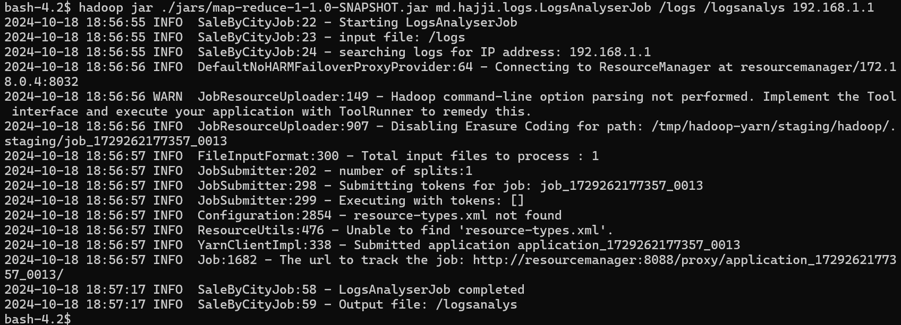

finally we can check results:

